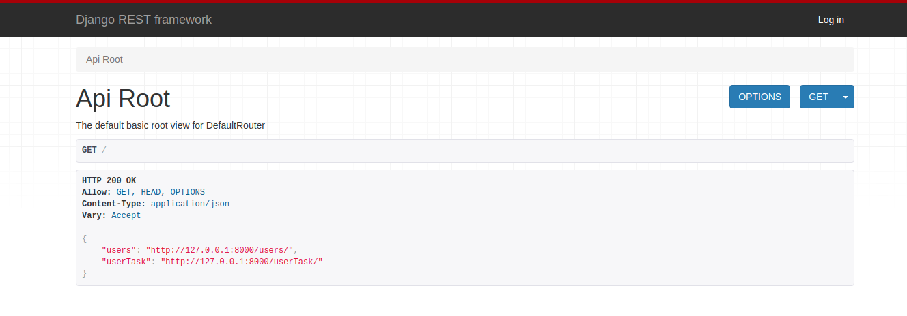
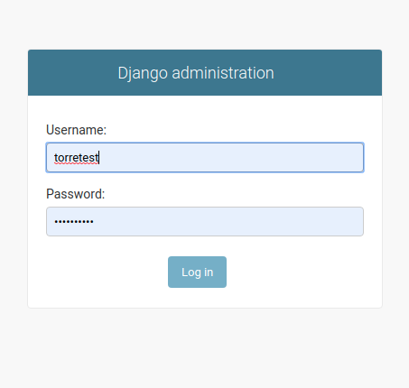
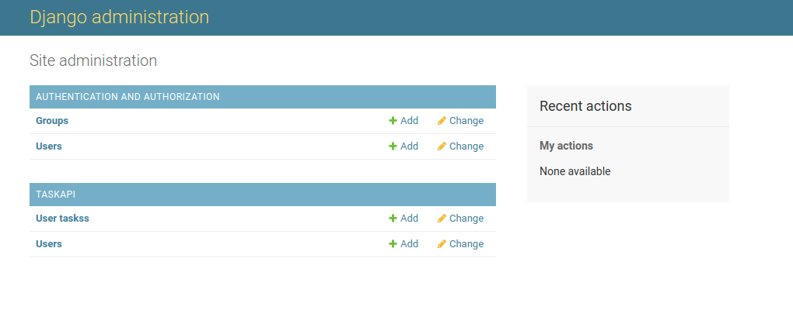

# Rose Global - Backend
## Technical Test Full-Stack Engineering

At Rose Global we are creating a new MVP, this new platform must be scalable and flexible to support our continuous growth. We want to implement a micro-service architecture

This is the project for the requerid API REST endpoints.

### Requirements

* Python version 3.6
* Django version 2.2.4
* Django rest framework version 3.10

### Installation guide

1. Clone the project
2. Execute python manage.py runserver to run the project
3. By default, the application will be available in http://127.0.0.1:8000/
4. You will have the Django Rest Framework browsable ui (More info in https://www.django-rest-framework.org/topics/browsable-api/). 

5. There are the two available end points: user and userTask. Click any of those links to test POST and GET methods. 
6. If needed, you also have the Django Admin interface in http://127.0.0.1:8000/admin (More info in ).Login with user torretest and password 1234567890.

7. Use it for testing crud actions over the data in **Taskapi** section

### Roadmap

#### V 1.0
* User and userTask models implemented
* Browsable interface
* Admin interface

#### V 1.1
* Filtering options

#### V 1.2
* Autentication

#### V 1.3
* Unit tests

#### V 1.4
* Swagger documentation
